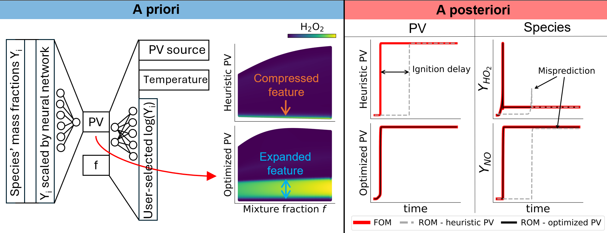

[](https://doi.org/10.5281/zenodo.18743452)


<!--(https://zenodo.org/) -->

# Progress variable optimization: Effects on the manifold topology and reduced-order modeling
This repository contains the code, data and results for the paper:

> G. Corlùy, K. Zdybał, A. Parente - [*Progress variable optimization: Effects on the manifold topology and reduced-order modeling*](https://doi.org/10.1016/j.egyai.2026.100783), Energy&AI, 25:100783, September 2026

You can find the open-source article here: https://www.sciencedirect.com/science/article/pii/S2666546826001096.

To cite this publication:

```
@article{corluy2026progress,
  title={Progress variable optimization: Effects on the manifold topology and reduced-order modeling},
  author={Corlùy, Grégoire and Zdybał, Kamila and Parente, Alessandro},
  journal={Energy and AI},
  volume={25},
  pages = {100783},
  issn = {2666-5468},
  month = sep,
  year={2026},
  publisher={Elservier},
  doi={10.1016/j.egyai.2026.100783},
}
```

## Background and motivation

Reduced-order models (ROMs) have become increasingly popular in many engineering and energy applications as a tool to design and optimize systems at a reduced computational cost. In the field of reacting flows, ROMs can be built by projecting the high-dimensional state space onto a low-dimensional manifold. In the past, the manifold parametrization was defined by physical variables based on expert knowledge. Recently, the encoder-decoder architecture has emerged as a tool to automatically optimize the manifold parametrization. Many successful implementations exist in the literature applying the encoder-decoder to find a manifold parametrization and perform a ROM simulation with it. However, there lacks a formal analysis to understand how an optimized parametrization performs better than a heuristic parametrization for a ROM simulation. Hence, this work compares the optimized parametrization with a heuristic one both *a priori* as *a posteriori* for a 0D hydrogen flame dataset. This work illustrates step-by-step how and why the optimized parametrization is better than the heuristic one and how it translates to the ROM performance.

## Graphical abstract



## What do we learn from the paper?

The paper shows how stretching the important manifold regions help to improve the reduced-order model. This analysis is performed by comparing an optimized manifold obtained with the encoder-decoder with heuristic manifold parameterizations, defined based on expert knowledge. Owing to the species selected at the decoder's output, the encoder-decoder stretches out important manifold regions which facilitates regression of the source term and species. The improvements of the encoder-decoder are enhanced by two novel concepts: the trainable scaling layer and the QoIs transformed to the logarithmic scale. Both contributed and enhanced the stretching of the regions near the boundaries of the manifold, which furhter improved the accuracy of the ROM simulation. Additionally, the optimized progress variable, defined as a linear combination of the species mass fractions and obtained by the encoder-decoder, could be sparsified to only a few species without altering the manifold quality although the encoder-decoder used all species at the input.

## Test case and training dataset

The test case is a premixed hydrogen flame in a 0D batch reactor with an initial temperature of 900K and atmospheric pressure. The reduced mechanism of Glarborg is used containing 21 species and 109 reactions. And the autoignition dataset is generated for 100 equally-spaced trajectories with the mixture fraction ranging from 0.015 to 0.035.

The data has been generated with the notebook `autoignition-data_generation-H2-air.ipynb` provided by Kamila Zdybał and can be found on [Zenodo](https://zenodo.org/records/18743452) as the files are too large in size to be stored on GitHub.

A flamelet dataset was used as second dataset to verify that the findings obtained with the autoignition dataset generalize to a more complex case. This dataset was generated with the script `flamelet-data_generation.py` written by Yuki Murakami. The freely-propagating flat flame of a premixed hydrogen-air mixture was generated with equally-spaced equivalence ratios ranging from 0.35 to 0.7 using the same Glarbord mechanism. The temperature and pressure where initialized to 300K and 1atm.

## Repository structure

- **Data/** – Data obtained from the different metrics (MSE and cost function) applied to the different models and parametrizations.  
- **Figures/** – Notebooks to generate the figures from the paper.  
- **Metrics/** – Implementation of quantitative metrics for *a priori* manifold assessment.  
- **Models/** – Model weights and the metadata of the PV source term models and full state-space models for the optimized and heuristic parametrizations.  
- **Training/** – Scripts and notebooks to train the models and generate the dataset.
  - `ANN_regression.py` – Class defining a standard PyTorch fully-connected artificial neural network.  
  - `autoignition-data_generation-H2-air.ipynb` – Generates the dataset with a 0D batch reactor.  
  - `Create-autoignition_augm-dataset-for-PV-encoder-decoder-training.ipynb` – Converts the generated dataset from `autoignition-data_generation-H2-air.ipynb` to a dataset in the correct format to train the encoder-decoder. Moreover, the logarithm of the species are added as additional features.
  - `flamelet-data_generation.py` – Generates the flamelet dataset.
  - `loader.py` – Class defining a loader to load the model, training and validation curves and the metadata.  
  - `models.py` – Class defining the architecture and all help functions of the encoder-decoder in PyTorch.
  - `tools.py` – Functions used during the analysis to sample the dataset, load data, compute the density, visualize, compute metrics... 
  - `Train-ANN-back full state space - sparse.ipynb` – Notebook to train the full state-space model of the sparsified optimized PV.  
  - `Train-ANN-back full state space.ipynb` – Notebook to train the full state-space model of the optimized PV.  
  - `Train-ANN-PV-source-model-seeds-sparse.py` – Python script to train the PV source term model of the sparsified optimized PV.  
  - `Train-ANN-PV-source-model.py` – Python script to train the PV source term model of the optimized PV.
  - `utils.py` – Script containing functions and classes to create directories, save models and metadata, get species names, get datasets in correct format, get the loss criterion and optimizer for the encoder-decoder training, get the variance or cost based on the variance file name.  
  - `visualizations.py` – Functions to plot common figures like the f-PV manifold or the PV definition.

## Installation

- **Python version:** 3.10.10  
- **Dependencies:** All necessary packages are listed in `requirements_PV_ROM.txt` at the root of the repository.  
- To install them:

```bash
pip install -r requirements_PV_ROM.txt
```

> Note: This project also depends on the **[PCA-Fold](https://github.com/kamilazdybal/PCAfold)** library, which must be installed separately.

## Acknowledgements

This work was supported by the Walloon Region through the Fonds de La Recherche Scientifique - FNRS for the FRFS-WEL-T under Grant n. WEL-T-CR-2023 A - 07.

A special thank to Kamila Zdybał who provided many snippets of codes or even complete notebooks for this work. Moreover, she also provided invaluable advice for the experiments, the figures, the graphical abstract and the work in general.

I would also like to thank Yuki Murakami for generating the flamelet dataset and providing insights concerning the combustion chemistry and chemical mechanisms.

## Contact

For any questions or inquiries, please contact Grégoire Corlùy at: gregoire.stephane.corluy@ulb.be

## License

This project is licensed under the MIT License. See the [LICENSE](LICENSE) file for details.
